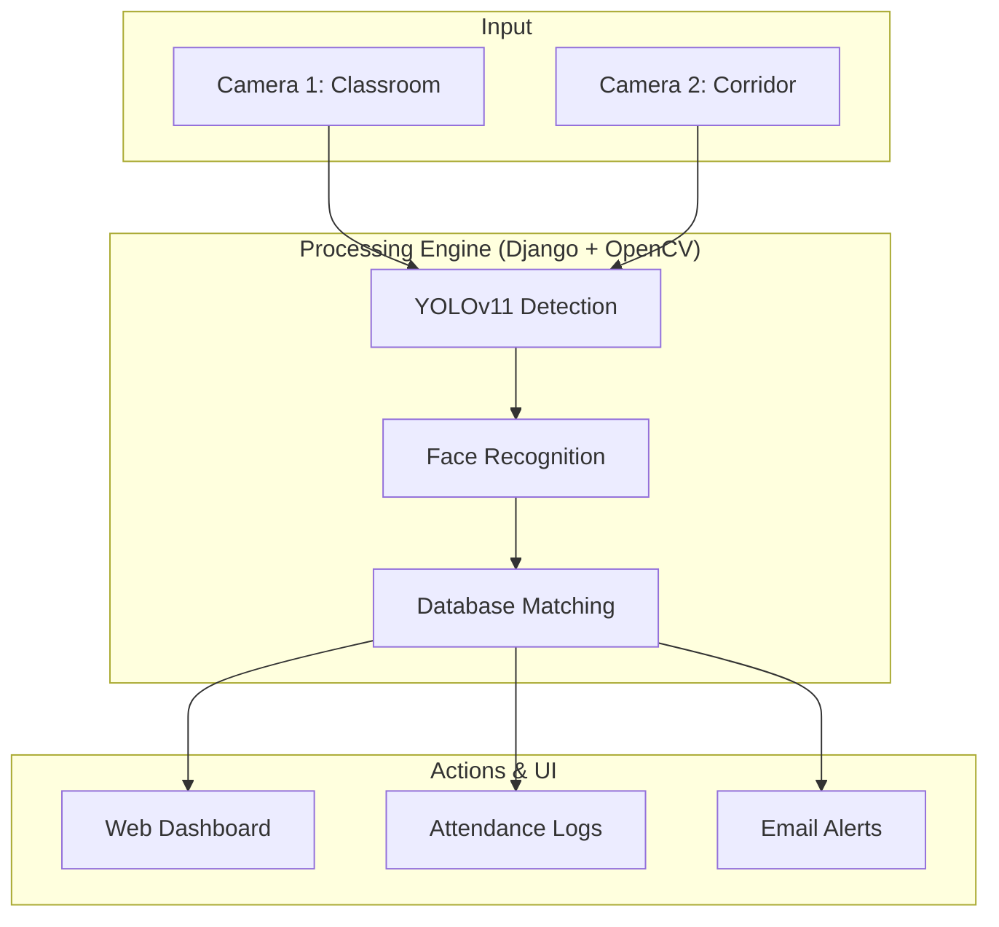

# FaceRec Pro: Anti-Class Skipping System 🛡️


**FaceRec Pro** is a premium, real-time surveillance and attendance management system powered by Face Recognition and AI. It is designed to monitor student presence across multiple locations (e.g., Classroom & Corridors) and automatically alert authorities via email in case of unauthorized absence or "skipping".

> [!NOTE]
> This is a functional prototype designed for dual-camera setups. It can utilize a laptop's default camera and an external USB webcam to simulate two distinct monitoring zones.

---

## 🚀 Key Features

### 🔍 Advanced AI Detection
- **YOLOv11 Integration**: High-speed, accurate face localization.
- **Deep Face Recognition**: Real-time identification using specialized embeddings and distance matching.
- **Dual Camera Architecture**: Simultaneous processing of "Classroom" (primary) and "Corridor" (secondary) feeds.

### 🔐 Secure Authentication
- **Glassmorphic Auth**: Modern, high-end login and signup interfaces.
- **Forgot Password with OTP**: Secure password recovery system using 6-digit email OTPs.
- **Session Management**: Secure user sessions for administrative access.

### 🚨 Intelligent Alerts & Logging
- **Missing Student Tracking**: Detects when a student who was present in class is missing for more than a configurable threshold.
- **Automated Email Alerts**: Instant notifications sent to administrators with timestamps.
- **Corridor Detection**: Logs when a "missing" student is spotted in the corridor.
- **Automated Attendance**: Mark attendance automatically upon facial recognition.

### 📺 Management & Monitoring
- **CCTV Monitor Mode**: A clean, raw dual-feed monitor for traditional security viewing.
- **Management Dashboard**: Real-time statistics, attendance charts, and recent activity logs.
- **Detailed Reports**: Comprehensive searchable logs of all attendance and alert events.

---

## 🏗️ System Architecture



---

## 🛠️ Tech Stack

- **Backend**: Python 3.x, [Django 4.2](https://www.djangoproject.com/)
- **Computer Vision**: [OpenCV](https://opencv.org/), [Face Recognition](https://github.com/ageitgey/face_recognition)
- **AI/ML**: [Ultralytics YOLOv11](https://github.com/ultralytics/ultralytics)
- **Database**: MySQL (Production) / SQLite3 (Development)
- **Frontend**: Glassmorphic UI (Vanilla CSS), JavaScript (Vanilla)

---

## ⚙️ Installation & Setup

### 1. Prerequisites
- Python 3.8+
- Webcam(s) connected to your system.

### 2. Clone the Repository
```bash
git clone https://github.com/dev69z/anti-class-skipping-system.git
cd anti-class-skipping-system
```

### 3. Setup Virtual Environment (Recommended)
```bash
python -m venv venv
# Windows:
venv\Scripts\activate
# Linux/Mac:
source venv/bin/activate
```

### 4. Install Dependencies
```bash
pip install -r requirements.txt
```

### 5. Configure Email Alerts
Open `core/camera.py` and update the following configuration:
```python
EMAIL_SENDER = "your-email@gmail.com"
EMAIL_PASSWORD = "your-app-password"
EMAIL_RECEIVER = "admin-email@gmail.com"
```

### 6. Run Migrations & Start Server
```bash
python manage.py makemigrations
python manage.py migrate
python manage.py runserver
```

Access the application at `http://127.0.0.1:8000/`.

---

## 📸 Screenshots

| Login Page | Forgot Password |
| :---: | :---: |
|  |  |

---

## 📄 License
This project is licensed under the MIT License.

Developed with ❤️ for Advanced Surveillance Technology.
