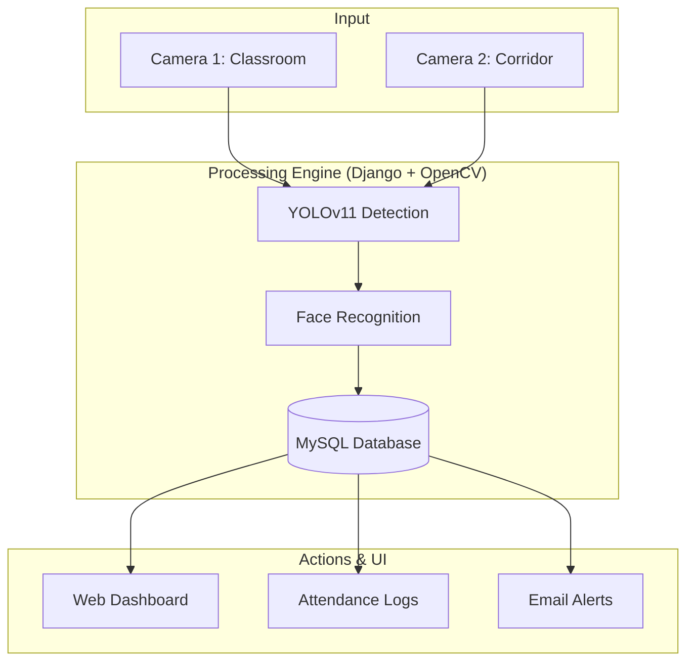

# FaceRec Pro: Anti-Class Skipping System 🛡️

[](https://www.python.org/)
[](https://www.djangoproject.com/)
[](https://opensource.org/licenses/MIT)

**FaceRec Pro** is a high-performance, real-time surveillance and attendance management system powered by AI. It monitors student presence across multiple zones (e.g., Classroom & Corridors) and automatically alerts authorities via email in case of "skipping".

> [!IMPORTANT]
> This system is designed for a **dual-camera setup** but can operate with a single camera for testing purposes. It utilizes YOLOv11 for face detection and a specialized deep-learning model for recognition.

---

## 🚀 Key Features

- **🔍 Advanced AI Detection**: Powered by Ultralytics YOLOv11 for blazing-fast face localization.
- **Dual Monitoring Zones**: Simultaneous tracking in "Classroom" (Primary) and "Corridor" (Secondary) areas.
- **🚨 Intelligent Alerts**: Automated email notifications when a target student is missing for more than X seconds.
- **📈 Management Dashboard**: Real-time stats, attendance logs, and incident tracking.
- **🔐 Secure Access**: Glassmorphic UI with OTP-based password recovery.

---

## 🏗️ System Architecture



---

## 🛠️ Tech Stack

- **Backend**: Python 3.8+, Django 4.2
- **AI/ML**: Ultralytics YOLOv11, face_recognition
- **Database**: MySQL (Primary) / SQLite (Dev)
- **Frontend**: Glassmorphic UI (Vanilla CSS & JS)

---

## ⚙️ Installation & Setup

Follow these steps to get FaceRec Pro running on your local machine.

### 1. Prerequisites
- **Python 3.8+** installed.
- **MySQL Server** installed and running.
- One or more **Webcams** connected.

### 2. Clone and Prepare
```bash
git clone https://github.com/dev69z/anti-class-skipping-system.git
cd anti-class-skipping-system
```

### 3. Setup Virtual Environment
```bash
python -m venv venv

# Windows
venv\Scripts\activate

# Linux/Mac
source venv/bin/activate
```

### 4. Install Dependencies
```bash
pip install -r requirements.txt
```

### 5. Database Configuration
1. Create a MySQL database named `face_rec_db`:
   ```sql
   CREATE DATABASE face_rec_db;
   ```
2. Update your credentials in `face_rec_project/settings.py` (if different from default `root` with no password).

### 6. Email Alert Configuration
Configure your Gmail App Password in `core/camera.py` for automated alerts:
```python
EMAIL_SENDER = "your-email@gmail.com"
EMAIL_PASSWORD = "your-app-password" # Use Gmail App Passwords
EMAIL_RECEIVER = "admin-email@gmail.com"
```
> [!TIP]
> To generate an App Password, go to your Google Account Settings > Security > 2-Step Verification > App Passwords.

### 7. Initialize and Run
```bash
python manage.py makemigrations
python manage.py migrate
python manage.py runserver
```

Access the app at: [http://127.0.0.1:8000/](http://127.0.0.1:8000/)

---

## 📸 Screenshots

| Dashboard Overview | Login Interface |
| :---: | :---: |
| _Coming Soon_ | _Coming Soon_ |

---

## 📄 License
This project is licensed under the MIT License - see the [LICENSE](LICENSE) file for details.

Developed with ❤️ for Advanced Surveillance Technology.
